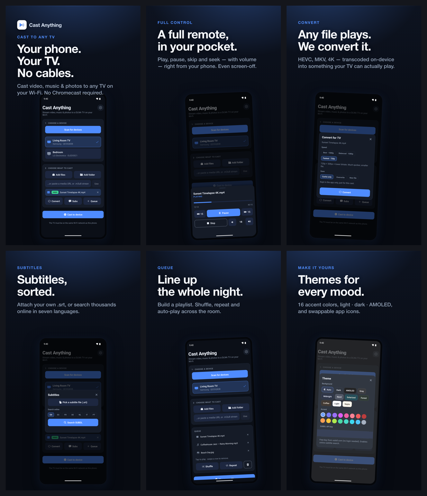

# Cast Anything — Play Store screenshots

Advertisement-style phone screenshots for the Google Play listing. Each slide pairs a
punchy headline with a real, framed app screen. Built from the actual app UI (dark
base + blue accent), not mockups.



## Output

- **6 slides**, `out/*.png`, **2160×3840** (2× of 1080×1920, 9:16 — a valid Play phone size).
- Also copied to `../fastlane/metadata/android/en-US/images/phoneScreenshots/`, so
  `fastlane supply` (or `scripts/submit-android.sh`) uploads them with the release.
- Play accepts 2–8 phone screenshots; this is the full set of 6.

| # | File | Feature | Headline |
|---|------|---------|----------|
| 1 | `1_hero` | Cast to any TV (hero) | Your phone. Your TV. No cables. |
| 2 | `2_control` | Now Playing / remote | A full remote, in your pocket. |
| 3 | `3_convert` | On-device convert | Any file plays. We convert it. |
| 4 | `4_subtitles` | Subtitles (SUBDL) | Subtitles, sorted. |
| 5 | `5_queue` | Queue / playlist | Line up the whole night. |
| 6 | `6_themes` | Theming | Themes for every mood. |

## Files

```
index.html   the generator — design tokens + the SLIDES array (copy, shot, layout)
shots/       raw 1080×2424 device captures + app-icon.png (the phone-frame content)
out/         rendered slides (the deliverables)
render.sh    rasterizes every slide via headless Chrome
preview.png  contact sheet of all six
```

## Regenerate

```bash
./render.sh          # re-renders all slides from index.html → out/ + fastlane
```

Open `index.html` in a browser to preview/tweak; append `#shot-3` to isolate one
slide full-viewport (that's what `render.sh` screenshots).

### Edit copy or layout
Everything lives in the `SLIDES` array in `index.html`:
- `headline` — use `\n` for line breaks; keep it readable at thumbnail size.
- `sub` — one supporting line.
- `layout` — `center` | `left` | `right` (shift + subtle tilt). Keep adjacent slides
  different so the carousel has rhythm.
- `shot` — path under `shots/`.

## Listing assets (icon + feature graphic)

Beyond the phone screenshots, the Play listing needs two more images, both written
into `../fastlane/metadata/android/en-US/images/`:

- **`icon.png`** — 512×512 hi-res icon, downscaled from `../assets/icon.png` (opaque).
- **`featureGraphic.png`** — 1024×500 banner, authored in `feature-graphic.html` and
  supersampled from 2×. Regenerate after editing that file:

  ```bash
  CHROME="/Applications/Google Chrome.app/Contents/MacOS/Google Chrome"
  "$CHROME" --headless=new --disable-gpu --allow-file-access-from-files \
    --force-device-scale-factor=2 --window-size=1024,500 --virtual-time-budget=2500 \
    --screenshot=out/_fg_2x.png "file://$PWD/feature-graphic.html"
  python3 -c "from PIL import Image; Image.open('out/_fg_2x.png').convert('RGB').resize((1024,500), Image.LANCZOS).save('../fastlane/metadata/android/en-US/images/featureGraphic.png')"
  ```

## Tablet screenshots (7" + 10")

Landscape slides (2560×1600) for the tablet slots, authored in `tablet.html` — the
real app in a device frame beside larger copy (a good look for a portrait, phone-first
app). The same set fills both the 7" and 10" slots. Regenerate:

```bash
CHROME="/Applications/Google Chrome.app/Contents/MacOS/Google Chrome"
FL=../fastlane/metadata/android/en-US/images
for p in 1:1_hero 2:2_control 3:3_convert 4:4_subtitles 5:5_queue 6:6_themes; do
  i=${p%%:*}; n=${p##*:}
  "$CHROME" --headless=new --disable-gpu --allow-file-access-from-files \
    --force-device-scale-factor=2 --window-size=1280,800 --virtual-time-budget=2500 \
    --screenshot=out/tablet/$n.png "file://$PWD/tablet.html#shot-$i"
  cp out/tablet/$n.png $FL/sevenInchScreenshots/$n.png
  cp out/tablet/$n.png $FL/tenInchScreenshots/$n.png
done
```

## Upload to Play (listing assets only)

`fastlane android update_listing` uploads the icon, feature graphic and phone
screenshots **only** — no binary, no listing text — and commits the edit. Run it with
the personal-account key:

```bash
GOOGLE_PLAY_JSON_KEY=/Users/jeramai.faber/PhpstormProjects/gameout/revenuecat-key.json \
  bundle exec fastlane android update_listing
```

> **Permission needed (one-time).** The `revenuecat-service-account@gameout-501508`
> key can release to tracks but is **not** authorized to edit the store listing, so
> the commit fails with `The caller does not have permission` (all images upload into
> the edit first, then the commit is rejected and the edit is discarded — nothing
> changes). Fix in Play Console → **Users and permissions** → that service account →
> grant **“Edit store listing, pricing & distribution”** (app or account level), then
> re-run the command above. Alternatively, upload the images by hand in the Console
> (**Main store listing** → graphics) from `out/` / the `images/` folder.

(The separate `submit` lane still uploads only the `.aab` to the internal track.)

### Capture new app screens
Screens come straight off a device/emulator at the phone's native resolution:

```bash
adb exec-out screencap -p > shots/NN-name.png      # 1080×2424 on a Pixel 9
```

Notes from this set:
- Use the **dark** theme + blue accent for consistency (`adb shell cmd uimode night yes`).
- A clean status bar helps: enable SystemUI demo mode
  (`adb shell am broadcast -a com.android.systemui.demo -e command clock -e hhmm 0940`,
  plus `battery level 100`, `network wifi ... level 4`, `notifications visible false`).
- An **emulator can't discover a real DLNA/Samsung TV** (no LAN multicast), so the
  "device found / now playing / queue" screens here were produced by temporarily
  seeding `useCast` with believable state via a `__DEV__`-gated dev seam, capturing
  the real components, then reverting the seam. Regenerate those on a physical phone
  against a real TV if you'd rather use live playback.
- Feature screens (convert, subtitles, themes) are genuine live captures.
